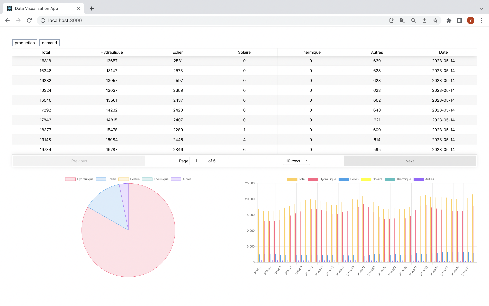

# Data Visualization App Frontend
## Getting Started

Install dependencies

``` npm install ```

Start backend server

``` npm start ```

Data visualization app will now run on [localhost:3000](http://localhost:3000)

(Note: Please make sure back end server is running at seperate terminal, please visit [this link](https://github.com/tsuninterview/take_home_be/blob/master/README.md) to set up back end.)
## Features


#### Table
###### Production table
 *  Columns: Total, Hydraulique, Eolien, Solaire, Thermique, Autres, Date.
 *  Sort in ascending/descending order by columns.
 *  Table pagination, default to 10.
###### Demand table
 *  Columns: Total, Date.
 *  Sort in ascending/descending order by columns.
 * Table pagination, default to 10.

#### Chart
###### Pie chart
 * Displays the sum of each subcategories, if there is no subcategory(ex demand) will display sum of all total values available.
   * Prodution: Hydraulique, Eolien, Solaire, Thermique, Autres.
   * Demand: Total.

###### Bar chart
 * Displays subcategories data for each group/valeur.
   * Production: Hydraulique, Eolien, Solaire, Thermique, Autres.
   * Demand: Total.
 * Zoom in/out to change scale.

 ## Tech Stacks

 * React, Redux, Tailwind CSS/SASS